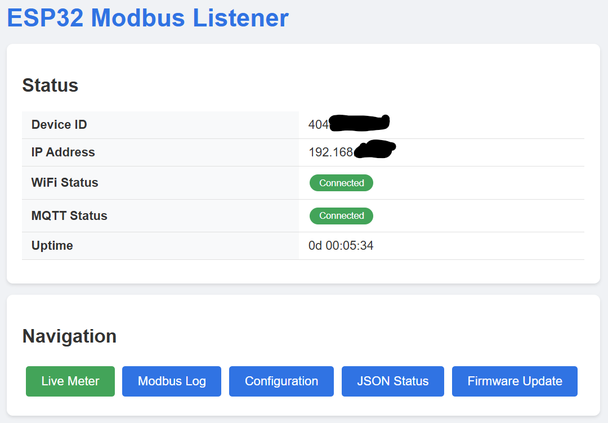
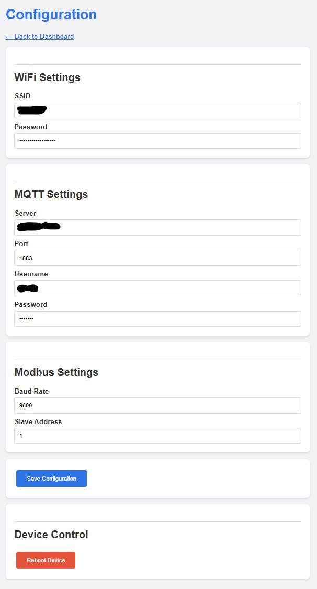
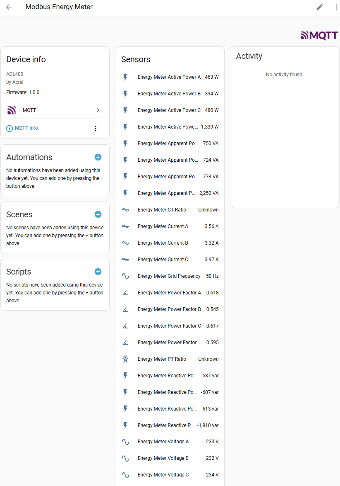

# ESP32 Modbus Listener

A passive Modbus RTU bus listener based on ESP32-C3 Mini that monitors communication on a Modbus bus, parses Acrel ADL400 three-phase energy meter data, and publishes it via MQTT with Home Assistant auto-discovery.



## Features

- **Passive Bus Listening** — monitors Modbus RTU traffic without interfering with existing master/slave communication
- **ADL400 Meter Parsing** — decodes Acrel ADL400 responses including:
  - Voltage (phases A, B, C)
  - Current (phases A, B, C)
  - Active Power (phases A, B, C, Total)
  - Reactive Power (phases A, B, C, Total)
  - Apparent Power (phases A, B, C, Total)
  - Power Factor (phases A, B, C, Total)
  - Grid Frequency
  - PT / CT Transformer Ratios
- **MQTT Integration** — publishes all meter parameters to Home Assistant via auto-discovery
- **Web Interface** — live meter dashboard, Modbus traffic log, configuration page, and OTA firmware update
- **Register Discovery** — tracks which Modbus registers are being polled, alerts on new/unknown register accesses
- **WiFi AP Mode** — creates an access point for initial configuration when no WiFi is configured

## Hardware Requirements

| Component | Description | Quantity |
|-----------|-------------|----------|
| ESP32-C3 Mini | Main microcontroller | 1 |
| RS485 to TTL Adapter | With automatic direction control (no DE/RE pin) | 1 |
| Power Supply | 5V DC | 1 |

### RS485 Adapter Requirements

The RS485 adapter must have **automatic direction control** (no DE/RE pin required). Typical pins:
- VCC (5V), GND
- TX (TTL transmit), RX (TTL receive)
- A (RS485+), B (RS485-)

## Pin Configuration

| Function | GPIO Pin | Description |
|----------|----------|-------------|
| RS485 RX | GPIO2 | Receive bus traffic |
| Status LED | GPIO8 | Built-in LED on ESP32-C3 Mini |

## Wiring Diagram

```
┌──────────────────┐          RS485 Bus          ┌──────────────────┐
│   MODBUS MASTER  │◄─────────A / B──────────────►│   MODBUS SLAVE   │
│  (External PLC)  │                              │  (Acrel ADL400)  │
└──────────────────┘                              └──────────────────┘
                                │
                                │  (parallel tap)
                                │
                         ┌──────┴──────┐
                         │  RS485      │
                         │  Adapter    │
                         │  A    B     │
                         │       RX    │
                         └───────┬─────┘
                                 │
                                 └──── GPIO2 (RX)
                         ┌─────────────┐
                         │ ESP32-C3    │
                         │ Mini        │
                         │ GPIO8 ─ LED │
                         └─────────────┘
```

The ESP32 passively taps the RS485 bus in parallel. It sees both master requests and slave responses, allowing it to correlate register reads with their data.

> **MAX485 Module Tip:** If using a MAX485 (or similar) module, connect the **RO** (Receiver Output) pin to **GPIO2** as RX. Tie both **/RE** (active-low Receiver Enable) and **DE** (Driver Enable) to **GND** to permanently put the module in listen-only mode, since this device never transmits on the bus.

## Software Requirements

### PlatformIO (Recommended)

1. Install [Visual Studio Code](https://code.visualstudio.com/)
2. Install the [PlatformIO IDE extension](https://platformio.org/install/ide?install=vscode)

### Arduino IDE

1. Install [Arduino IDE](https://www.arduino.cc/en/software) (version 2.x recommended)
2. Add ESP32 board support:
   - **File → Preferences** → Additional Board Manager URLs:
     ```
     https://raw.githubusercontent.com/espressif/arduino-esp32/gh-pages/package_esp32_index.json
     ```
   - **Tools → Board → Board Manager** → install "esp32 by Espressif Systems"
3. Select board: **Tools → Board → ESP32C3 Dev Module**

### Required Libraries

| Library | Purpose |
|---------|---------|
| WiFi | WiFi connectivity (built-in) |
| WebServer | Web interface (built-in) |
| Preferences | Flash configuration storage (built-in) |
| PubSubClient | MQTT client |
| ArduinoJson | JSON handling for MQTT and web API |

## Building and Flashing

### Using PlatformIO

```bash
# Build
pio run

# Upload to ESP32-C3
pio run --target upload

# Monitor serial output
pio device monitor
```

### Using Arduino IDE

1. Open `src/ESP32_Modbus_listener.ino`
2. Select **Tools → Board → ESP32C3 Dev Module**
3. Set **USB CDC On Boot: Enabled**
4. Select the correct **Port** and click **Upload**

## Configuration

### Initial Setup

1. On first boot, the device creates a WiFi access point:
   - **SSID**: `ModbusListener-XXXX`
   - **Password**: `modbuslistener`
2. Connect to the AP and navigate to `http://192.168.4.1`
3. Configure WiFi credentials, MQTT server, and Modbus baud rate

### Web Interface

Once connected to your WiFi network, access `http://<device-ip>/`:

- **Dashboard** — device status overview
- **Live Meter** — real-time voltage, current, power, frequency with register access monitor
- **Modbus Log** — raw frame log with CRC validation
- **Configuration** — WiFi, MQTT, and Modbus settings
- **Firmware Update** — OTA upload




## Home Assistant Integration

The device publishes MQTT auto-discovery messages. After connecting, entities appear automatically:



### MQTT Topics

| Topic | Description |
|-------|-------------|
| `modbus_listener/<id>/status` | Device online/offline |
| `modbus_listener/<id>/meter` | All meter values as JSON |
| `modbus_listener/<id>/ip` | Device IP address |

### Discovered Entities

- Voltage (A, B, C)
- Current (A, B, C)
- Active Power (A, B, C, Total)
- Reactive Power (A, B, C, Total)
- Apparent Power (A, B, C, Total)
- Power Factor (A, B, C, Total)
- Grid Frequency
- PT / CT Ratios

## Target Device

**Acrel ADL400 (MID)** — Three-phase energy meter with Modbus RTU interface.

### Supported Register Map

The listener parses the following holding registers (function code `0x03`) from the ADL400:

| Register | Address | Scale | Unit | MQTT Key | HA Entity |
|----------|---------|-------|------|----------|-----------|
| Voltage A | 0x0061 | ×0.1 | V | `voltage_a` | Energy Meter Voltage A |
| Voltage B | 0x0062 | ×0.1 | V | `voltage_b` | Energy Meter Voltage B |
| Voltage C | 0x0063 | ×0.1 | V | `voltage_c` | Energy Meter Voltage C |
| Current A | 0x0064 | ×0.01 | A | `current_a` | Energy Meter Current A |
| Current B | 0x0065 | ×0.01 | A | `current_b` | Energy Meter Current B |
| Current C | 0x0066 | ×0.01 | A | `current_c` | Energy Meter Current C |
| Active Power A | 0x0067 | 1 | W | `power_a` | Energy Meter Active Power A |
| Active Power B | 0x0068 | 1 | W | `power_b` | Energy Meter Active Power B |
| Active Power C | 0x0069 | 1 | W | `power_c` | Energy Meter Active Power C |
| Active Power Total | 0x006A | 1 | W | `power_total` | Energy Meter Active Power Total |
| Reactive Power A | 0x006B | 1 | var | `reactive_a` | Energy Meter Reactive Power A |
| Reactive Power B | 0x006C | 1 | var | `reactive_b` | Energy Meter Reactive Power B |
| Reactive Power C | 0x006D | 1 | var | `reactive_c` | Energy Meter Reactive Power C |
| Reactive Power Total | 0x006E | 1 | var | `reactive_total` | Energy Meter Reactive Power Total |
| Apparent Power A | 0x006F | 1 | VA | `apparent_a` | Energy Meter Apparent Power A |
| Apparent Power B | 0x0070 | 1 | VA | `apparent_b` | Energy Meter Apparent Power B |
| Apparent Power C | 0x0071 | 1 | VA | `apparent_c` | Energy Meter Apparent Power C |
| Apparent Power Total | 0x0072 | 1 | VA | `apparent_total` | Energy Meter Apparent Power Total |
| Power Factor A | 0x0073 | ×0.001 | — | `pf_a` | Energy Meter Power Factor A |
| Power Factor B | 0x0074 | ×0.001 | — | `pf_b` | Energy Meter Power Factor B |
| Power Factor C | 0x0075 | ×0.001 | — | `pf_c` | Energy Meter Power Factor C |
| Power Factor Total | 0x0076 | ×0.001 | — | `pf_total` | Energy Meter Power Factor Total |
| Frequency | 0x0077 | ×0.01 | Hz | `frequency` | Energy Meter Grid Frequency |
| PT Ratio | 0x008D | 1 | — | `pt` | Energy Meter PT Ratio |
| CT Ratio | 0x008E | 1 | — | `ct` | Energy Meter CT Ratio |

All values are published as a single JSON object on `modbus_listener/<id>/meter`.

## License

MIT License — see [LICENSE](LICENSE).
